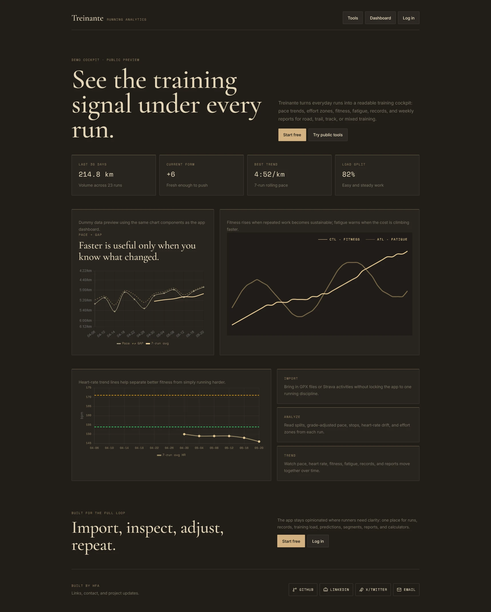
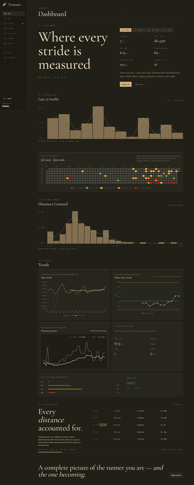

<p align="center">
  
</p>

<h1 align="center">treinante</h1>

<p align="center">
  <a href="https://treinante.hfanes.com/">Website</a>
</p>

<p align="center">
  Treinante is a running analytics platform for importing runs, analysing training, tracking progress, and using practical training tools. It is designed for road, trail, track, and mixed runners, with features that adapt to the data each runner provides.
</p>

<p align="center">
<a href="https://www.hfanes.com/">About me</a>
  ·
  <a href="https://x.com/hfa_dev">Twitter / X</a>
  ·
  <a href="https://github.com/Hfanes">GitHub</a>
</p>

## Screenshots

<p align="center">
  
</p>

<p align="center">
  
</p>

<p align="center">

</p>

<p align="center">
  
  
</p>

## Features

- Supabase authentication, onboarding, and protected routes
- GPX upload, Strava sync, and manual run entry
- Normalised run storage across all import sources
- Per-run analysis with splits, pace, heart rate, elevation, and GAP
- Dashboard charts for volume, pace, elevation, and heart rate trends
- Personal record extraction and history
- Fitness and freshness tracking with ATL, CTL, and TSB
- Race prediction tools
- Segment matching and progress tracking
- Weekly training summaries
- Public training calculators

## Getting Started

Install dependencies:

```bash
pnpm install
```

Create a local environment file:

```bash
cp .env.local.example .env.local
```

Fill in the required values in `.env.local`, then start the dev server:

```bash
pnpm dev
```

Open `http://localhost:3000` in your browser.

## Database Workflow

Database schema changes live in [`supabase/migrations`](./supabase/migrations). Do not rely on one-off SQL Editor changes as the source of truth.

Link the Supabase CLI once per machine:

```bash
pnpm exec supabase link --project-ref <ref>
```

Apply migrations:

```bash
pnpm db:push
```

Regenerate database types:

```bash
pnpm db:types
```

## Project Structure

```text
src/app/          Next.js App Router routes and route handlers
src/components/   Shared UI, layout, chart, run, tool, and segment components
src/hooks/        Client-side React hooks
src/lib/          Supabase, IndexedDB, import, calculation, and reporting helpers
src/types/        Shared TypeScript contracts and generated database types
prd/              Product requirements and build order
supabase/         SQL migrations and Supabase project files
```

## Development Notes

- Use `pnpm` for package operations, not npm or yarn.
- Do not install packages published less than 1 day ago.
- PRDs define product scope and implementation order.
- Keep schema changes in SQL migrations.
- Keep secrets out of git.

## Documentation

- [`prd/README.md`](./prd/README.md) - PRD index and suggested build order
- [`prd/00-overview/PRD.md`](./prd/00-overview/PRD.md) - product vision, architecture, and constraints
- [`AGENTS.md`](./AGENTS.md) - repository-specific working rules for agents
